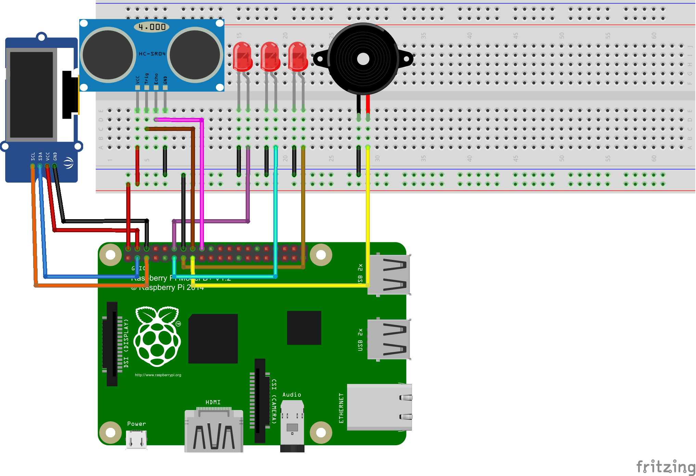

# Raspberry pi 5 - Distance sensor

## Description: 

### this project aims to measure the distance and display it on the OLED screen with some animation and audio from the LEDs and Buzzer.

#### the main file is **PythonCodeWithOLED.py** that file has all the features.

#### the other files has less features like testing the OLED or Testing the project without screen, GUI would be enough.

## Components:

### Raspberry pi 5 Distance sensor - project that measure distance using Ultrasonic sensor HC-SR04, OLED display SSH1106, buzzer, and LEDs

| Pins                     | Description                                                  |
| ------------------------ | ------------------------------------------------------------ |
| VCC -> 5v                | 5 volts from the Raspberry pi 5 to power the other components |
| GND -> GND               | Ground for the other components                              |
| SDA -> GPIO2 (pin 3)     | Serial Data pin for I2C communication between OLED display SSH1106 and Raspberry pi |
| SCL -> GPIO3 (pin 5)     | Serial Clock pin for I2C communication between OLED display SSH1106 and Raspberry pi |
| Echo - > GPIO24 (pin18)  | Echo pin for Ultrasonic sensor HC-SR04 Connection.           |
| Trig -> GPIO23 (pin16)   | Trigger pin for Ultrasonic sensor HC-SR04 Connection.        |
| LED1 -> GPIO17 (pin11)   | LED1 connection (GREEN Color)                                |
| LED2 -> GPIO18 (pin12)   | LED2 connection (BLUE Color)                                 |
| LED3 -> GPIO27 (pin13)   | LED3 connection (RED Color)                                  |
| buzzer -> GPIO22 (pin15) | Buzzer connection with Raspberry pi                          |
